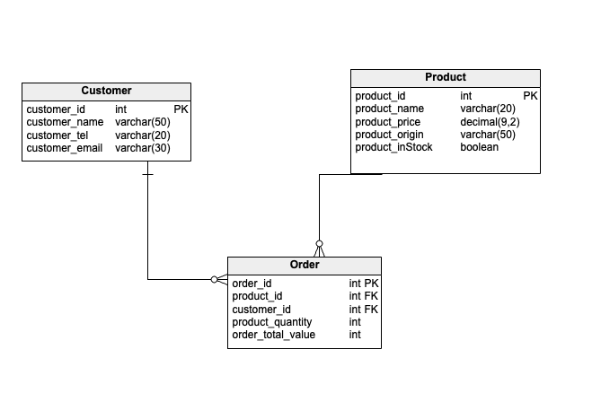

# REST API

## Members

1. Thuy Dang
2. Redeat Haile Haile
3. Khang Nguyen

## Requirements

This is a group assignment

1. Create ERD diagram then take screenshot and add it in the readme file
   

2. Create simple server base on the ERD. The server should have 5 endpoints:

2.1 Product

- GET /products
- GET /products/{productId}
- POST /products
- Delete /products/{productId}
- PUT /items/{productId}

  2.2 User

- Get /users/{userId}
- Post /users
- Put /users/{userId}

3. Create Swagger file for your project with product and user

## Deadline: **9am Thursday 14/03**
